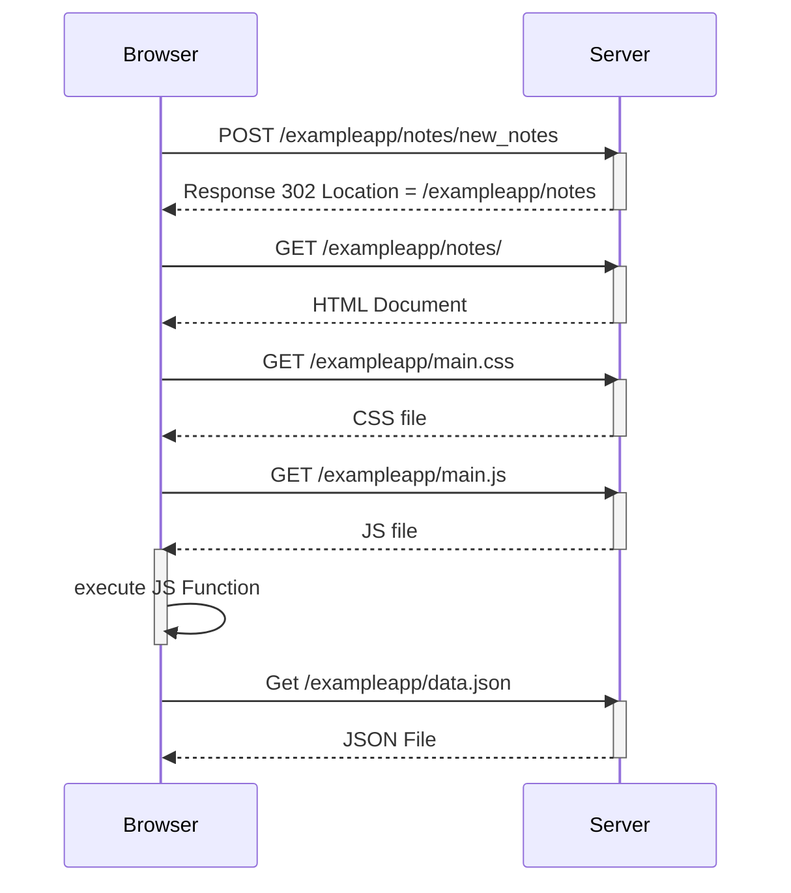

```mermaid
sequenceDiagram
    participant Browser;
    participant Server;

    Browser->>Server: POST /exampleapp/notes/new_notes
    activate Server;
    Server-->>Browser: Response 302 Location = /exampleapp/notes;
    deactivate Server;
    Browser->>Server: GET /exampleapp/notes/
    activate Server;
    Server-->>Browser: HTML Document
    deactivate Server;
    Browser->>Server: GET /exampleapp/main.css
    activate Server;
    Server-->>Browser: CSS file
    deactivate Server;
    Browser->>Server: GET /exampleapp/main.js
    activate Server;
    Server-->>Browser: JS file
    deactivate Server;
    activate Browser;
    Browser ->>Browser: execute JS Function
    deactivate Browser;
    Browser ->>Server: Get /exampleapp/data.json
    activate Server;
    Server -->>Browser: JSON File
    deactivate Server;
```

    