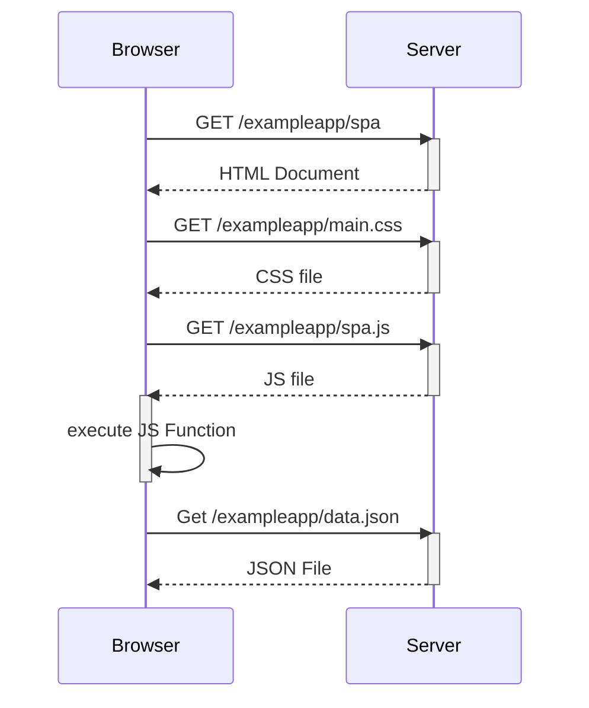

```mermaid
sequenceDiagram
    participant Browser;
    participant Server;
    
    Browser->>Server: GET /exampleapp/spa
    activate Server;
    Server-->>Browser: HTML Document
    deactivate Server;
    Browser->>Server: GET /exampleapp/main.css
    activate Server;
    Server-->>Browser: CSS file
    deactivate Server;
    Browser->>Server: GET /exampleapp/spa.js
    activate Server;
    Server-->>Browser: JS file
    deactivate Server;
    activate Browser;
    Browser ->>Browser: execute JS Function
    deactivate Browser;
    Browser ->>Server: Get /exampleapp/data.json
    activate Server;
    Server -->>Browser: JSON File
    deactivate Server;
    
```