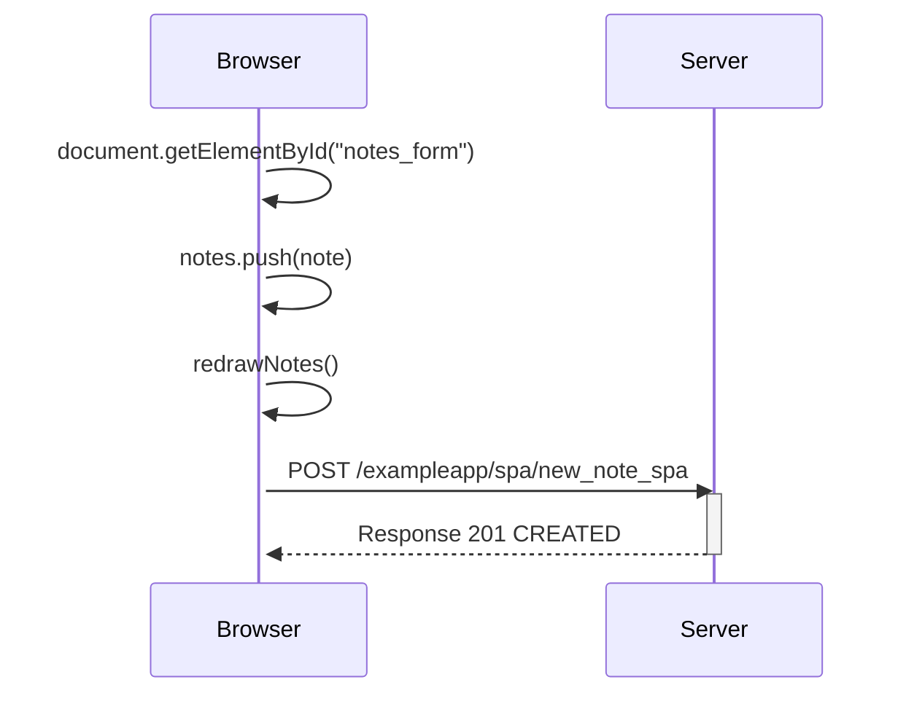

```mermaid
sequenceDiagram
    participant Browser;
    participant Server;

    activate Browser;
    Browser ->> Browser: document.getElementById("notes_form");
    Browser ->> Browser: notes.push(note);
    Browser ->> Browser: redrawNotes();
    Browser->>Server: POST /exampleapp/spa/new_note_spa
    activate Server;
    Server-->>Browser: Response 201 CREATED;
    deactivate Server;
    
```

    